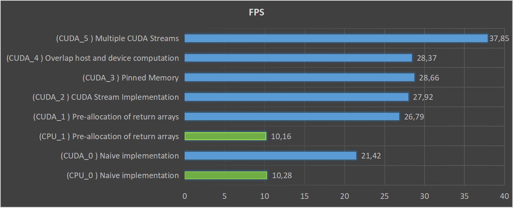

# Jetson Nano - OpenCV CUDA Optimization

### Test Code
- `CPU_0.py` : Naive implementation of CPU.
- `CUDA_0.py` : Naive implementation of CUDA GPU.
- `CPU_1.py` : Pre-allocation of return arrays of CPU.
- `CUDA_1.py` : Pre-allocation of return arrays of CUDA GPU.
- `CUDA_2.py` : CUDA Stream Implementation of CUDA GPU.
- `CUDA_3.py` : Pinned Memory of CUDA GPU.
- `CUDA_4.py` : Overlap host and device computation of CUDA GPU.
- `CUDA_5.py` : Multiple CUDA Streams with Pinned Memory of CUDA GPU.

### Result
- `CPU_0.py` : Execution Time : 0.0972 (FPS 10.28)
- `CUDA_0.py` : Execution Time : 0.0467 (FPS 21.42)
- `CPU_1.py` : Execution Time : 0.0984 (FPS 10.16)
- `CUDA_1.py` : Execution Time : 0.0373 (FPS 26.79)
- `CUDA_2.py` : Execution Time : 0.0358 (FPS 27.92)
- `CUDA_3.py` : Execution Time : 0.0349 (FPS 28.66)
- `CUDA_4.py` : Execution Time : 0.0352 (FPS 28.37)
- `CUDA_5.py` : Execution Time : 0.0264 (FPS 37.85)
- Graph : 

### Analysis
- `TODO`